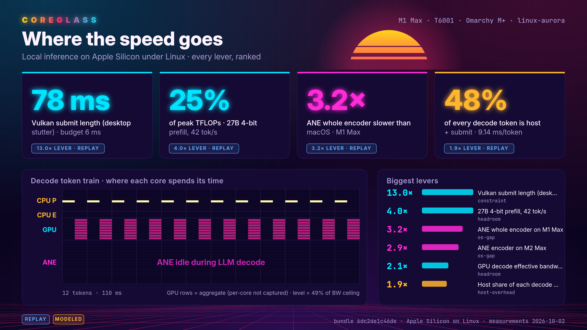
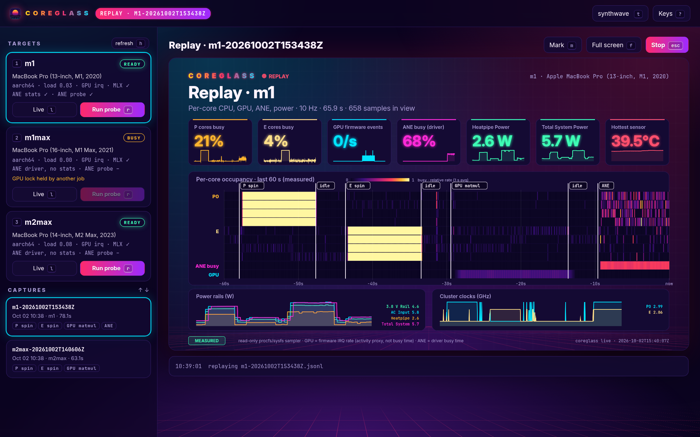
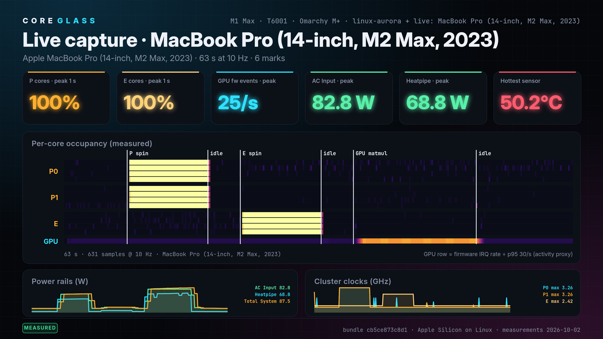
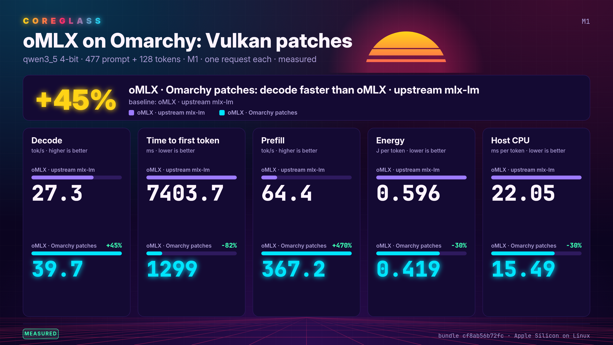

# Coreglass

[](https://github.com/sponsors/joshuaswarren)

Coreglass shows where local inference loses speed on Apple Silicon under Linux.
It is a desktop app for Omarchy and other Linux desktops.
It records live counters from the target laptops, runs marked workloads on them, and renders shareable frames.
It also writes a ranked summary that an LLM can read.



## Install

Python 3.11 or later. No dependencies. The viewer runs on x86_64 and arm64 Linux.
Chrome or Chromium is optional and only makes PNG files.

```sh
git clone https://github.com/joshuaswarren/coreglass ~/src/coreglass
uv tool install ~/src/coreglass        # or: cd ~/src/coreglass && python3 -m coreglass …
coreglass install                     # adds Coreglass to the app launcher (Super+Space on Omarchy)
```

The viewer reaches each target by SSH alias. Targets need Python 3 only; nothing is installed on them.
List your targets in `~/.config/coreglass/hosts.toml`. Start from [hosts.example.toml](hosts.example.toml).

## The app

Launch Coreglass from the app launcher, or run `coreglass` with no arguments.
It opens in its own window and drives everything from the keyboard.



| Key | Action |
|---|---|
| `1` to `9` | pick a target |
| `l` / `r` | watch it live / run the probe (P cores, E cores, GPU matmul, LLM, ANE) |
| `m` / `f` / `esc` | mark the timeline / full screen / stop |
| `↑` `↓` then `enter` | pick a capture and replay it |
| `b` | build shareable frames from the capture |
| `space` / `c` | mark a capture / share a comparison frame (marked captures, or this run's engines) |
| `t` | switch between the synthwave look and your current Omarchy theme |

Captures and frames live in `~/.local/share/coreglass/`.
`coreglass app --no-window --port 8777` serves the app to a browser instead.

## Quick start

```sh
coreglass hosts                      # reachable? arch, model, load, GPU lock, MLX per target
coreglass live m2max                 # live dashboard at http://127.0.0.1:8777/
coreglass run m2max                  # capture + P-core, E-core, GPU, LLM, and ANE probe steps, with marks
coreglass phases captures/<capture>.jsonl                      # per-phase means of that run
coreglass build reference captures/<capture>.jsonl -o out/x --png   # reference = bundled measurements
coreglass live x --replay captures/<capture>.jsonl --speed 4   # play a capture back
```

`coreglass run` refuses a busy target. Busy means a held GPU lock, load above 0.5, or a running benchmark.
For a run with nobody at the keyboard, add `--headless --wait 3h`. It waits until the target is free, then runs.
Add your own steps with `--step 'LABEL=CMD'`. A `--gpu-step` runs under the host GPU lock.
Each run writes the capture and a `.run.json` manifest. The manifest holds step times, exit codes, and preflight state.

## Live capture

The live view streams per-core CPU load, cluster clocks, power rails, temperatures, and GPU activity.
It samples at 10 Hz.
The sampler is read-only and needs no root. Press `m` to mark an event, `p` to save the dashboard as a 3200×1800 PNG.



Today the GPU row is the firmware interrupt rate. That shows activity, not busy time.
The ANE row and tile show measured busy time on targets whose driver exports `ane_stats`.
On other targets they say why the data is missing. `agx_stats` does the same for the GPU.
The probe drives the ANE when the target's entry sets `ane_cmd` (see [hosts.example.toml](hosts.example.toml)).

Set `llm_model` to an MLX model directory, and the probe also runs a real LLM request. It records prefill and
decode speed, time to first token, token gaps, and energy per token. It also records the workload's CPU time per
token by thread.
It also records disk reads, faults, and kernel warnings. List several `llm_runs` (see [hosts.example.toml](hosts.example.toml)).
The probe sends the same request through each engine: mlx-lm in process, `mlx_lm.server`, or oMLX. Each engine
runs with any Python and patch set you point it at. Then `coreglass phases` and the app show the engines side by side.
[docs/DESIGN.md](docs/DESIGN.md) has the full data coverage map. It lists what is still missing and why, and the
producer contract for the GPU and ANE drivers. [docs/RESULTS.md](docs/RESULTS.md) has measured results. It covers
an M1, an M1 Max, and an M2 Max on one software stack, four LLM engines each.

## Daily ledger

`coreglass ledger run` runs one frozen suite on every target and on an optional macOS reference.
The suite covers two models, mlx-lm and oMLX, GPU matmul, and ANE, with three reps each.
It then rewrites [docs/LEDGER.md](docs/LEDGER.md), one row per Mac, stack, and day.
Each cell shows the change against the previous day and against the best day.
Any regression over 1% is listed with the commit range that could explain it.
Copy [ledger.example.toml](ledger.example.toml) to `~/.config/coreglass/ledger.toml` to define the suite.

## Comparison frames



```sh
coreglass compare captures/<run>.jsonl --png --anonymize                 # every engine in one run
coreglass compare 'captures/<a>.jsonl#LLM=before' 'captures/<b>.jsonl#LLM=after' --png   # one step across runs
```

Each call writes one 1600×900 frame (`compare.png` at 3200×1800) plus `compare.json` and `compare.md`. The frame
shows decode, time to first token, prefill, energy per token, and host CPU per token for two to four variants. It
marks the winner and each variant's change against the first one. One request per variant cannot show run-to-run
noise, so a decode gap under 3% reads "no clear difference". In the app, press `c` on a run with several engines,
or mark captures with `space` and press `c`.

## Output

| File | Reader | Content |
|---|---|---|
| `index.html` | human | all frames, PNG/SVG export, ranked lever table |
| `frames/*.svg`, `frames/*.png` | social, docs | one 1600×900 frame each (`--png --scale 2` gives 3200×1800) |
| `summary.json` | LLM, scripts | `coreglass/summary/v1`: host, ranked findings, gaps in capture |
| `summary.md` | LLM, chat | the same ranking as a Markdown table |

Frames: `hero` · `time` · `bandwidth` · `util` · `flow` · `gaps`. A build with a live capture adds `capture`.
Every number carries provenance: `measured`, `replay`, `modeled`, or `demo`. The `--demo` flag adds synthetic
per-core texture to modeled heatmaps and stamps every frame `DEMO`. The `--anonymize` flag removes host names,
kernel strings, and capture file names before you post frames in public.

Fonts: Inter and JetBrains Mono, subset and embedded (SIL Open Font License, `coreglass/fonts/`).

## Tests

```sh
python3 -m unittest discover -s tests
```

Agents: read [AGENTS.md](AGENTS.md).

## Support

Every bit of support helps keep coreglass alive and free. If you are able, [sponsor on GitHub](https://github.com/sponsors/joshuaswarren) or send a Lightning donation to `joshuaswarren@strike.me` to directly fund continued development and new integrations.

[](https://github.com/sponsors/joshuaswarren)

If financial support is not an option, you can still make a big difference: [star the repo](https://github.com/joshuaswarren/coreglass), share it, or recommend it to a colleague. Word of mouth is how most people find coreglass.
