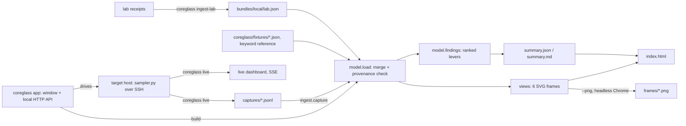

# Coreglass design

Coreglass shows where local inference loses speed on Apple Silicon under Linux.
It reads performance receipts, ranks the levers, and renders six frames.
A human opens one HTML file. An LLM reads one JSON summary.

## Goals

1. Show where time goes: prefill, decode, host, queue, GPU, ANE, sync.
2. Show the constraints: bandwidth, memory, power, queue length, lab gates.
3. Show data flow through host, Vulkan queue, GPU, ANE, and unified memory.
4. Show the speed of each component against two references: macOS and the measured ceiling.
5. Show GPU, ANE, and CPU occupancy as heatmaps.
6. Make every frame a shareable image that tells one story at thumbnail size.

## Rules

- **Every number has provenance.** `prov` is one of `measured`, `replay`, `modeled`, `demo`.
  The footer of each frame shows a chip for each kind of data in that frame.
  - `measured`: parsed from a receipt by `coreglass ingest-lab`.
  - `replay`: measured elsewhere and typed into a bundle (the committed fixture).
  - `modeled`: derived from measurements by a rule that the frame states.
  - `demo`: synthetic texture from `--demo`. Every frame then carries a red `DEMO` chip.
- **No stand-in data without a label.** A missing input renders as "not captured".
  It is never filled with a plausible value.
- **Standard library only.** Python 3.11, no runtime dependencies, no JavaScript build.
  Chrome is optional and only makes PNG files.
- **Frames are products.** Each frame is a 1600×900 SVG with a fixed layout.
  The headline number is at least 64 px, so it stays legible at 400 px wide.

## Data flow



## Bundle format (`coreglass/v1`)

A bundle is one JSON object. `coreglass build a.json b.json` merges bundles from left to right.
List sections concatenate. A later record with the same `id`, `op`, or `label` replaces the earlier one.
So a measured ingest replaces the replayed fixture value for the same item.
`host` merges key by key. Other keys are replaced.

| Section | Shape | Used by |
|---|---|---|
| `host` | `alias, chip, soc, os, kernel, gpu_cores, ane_cores, cpu_p, cpu_e, dram_gbs_spec` | all frames |
| `metrics[]` | `id, component, label, value, ceiling, unit, ref{label,value}` | hero, bandwidth, flow |
| `kernels[]` | `op, null_gbs, contig_gbs` or `kernel_gbs[lo,hi]`, `bound` | bandwidth |
| `request` | `label, caption, phases[{name, lane, ms, prov, note}]` | time |
| `token` | `label, total_ms, n, parts[{name, lane, ms}]` | time, util, flow, hero |
| `staircase[]` | `d1_ms, token_ms` (injected host delay vs token time) | time |
| `paired[]` | `id, component, host, label, linux_ms, macos_ms` | gaps, util, flow |
| `ablations[]` | `id, component, host, knob, metric, delta_pct, takeaway` | gaps, flow |
| `queues[]` | `id, component, label, observed_ms, budget_ms` | hero, flow |
| `limits[]` | `label, value, limit, unit, status` | gaps |
| `power[]` | `label, series[[t_s, W]], unit, metric, host` | gaps |
| `not_captured[]` | strings | gaps, summary |

`lane` is one of `cpu`, `queue`, `gpu`, `ane`, `sync`, `mem`. The lane sets the color.
Records that carry numbers also carry `prov` and `src` (a receipt path or a citation).

## Findings

`model.findings` turns the bundle into levers. Each lever has a `factor`: how much faster or
smoother the item gets if the gap closes. The list is sorted by factor.

| Kind | Factor | `proven_factor` |
|---|---|---|
| `headroom` | ceiling / achieved | macOS / achieved, if a macOS reference exists |
| `os-gap` | Linux ms / macOS ms | same |
| `geometry` | contiguous GB/s / real-geometry GB/s | none |
| `host-overhead` | token ms / GPU ms | none |
| `constraint` | observed / budget | none |
| `ablation` | 1 + abs(delta %) | none |

A `constraint` factor measures harm (for example desktop stutter), not throughput.
The kind is always shown next to the factor.

## Frames

| Frame | Question it answers |
|---|---|
| `hero` | What are the four biggest stories, and what are the top levers? |
| `time` | Where does a request spend time? What is inside one decode token? How much host slack exists? |
| `bandwidth` | How fast is each component and kernel against macOS and the ceiling? |
| `util` | Which cores work and which wait during decode? How does the ANE encoder compare with macOS? |
| `flow` | How does one token move through host, queue, GPU, and memory? Where does the ANE connect? |
| `gaps` | What does macOS already prove? What did the knobs do? Which limits bind? What is not captured? |

With a live capture in the build, the `util` and `hero` heatmaps show measured per-core CPU rows
and the GPU firmware event row. Without one, they are modeled. The decode heatmap then places the
measured token split on a time axis: CPU during build and submit, GPU during the wait, at the measured
share of the bandwidth ceiling. The ANE heatmap spreads equal work over the measured Linux and macOS
latencies. Per-core variation in a modeled heatmap appears only with `--demo`.

## Live capture

```sh
python3 -m coreglass live m2max                   # dashboard at http://127.0.0.1:8777/
python3 -m coreglass build reference captures/<file>.jsonl -o out/capture --png
```

`coreglass live` sends `sampler.py` over SSH (`python3 -u -`), so the target needs only Python 3 and
no install. The sampler is read-only and needs no root. It prints one JSON line per tick:

| Field | Source | Meaning |
|---|---|---|
| `meta` (line 1) | `/proc/device-tree/model`, cpufreq policies, hwmon, `/proc/interrupts` | host, clusters (E/P0/P1 by max clock), rails, IRQ names |
| `cpu[i]` | `/proc/stat` | busy fraction of core `i` over the tick |
| `khz{cluster}` | `scaling_cur_freq` | cluster clock |
| `w{rail}`, `c{sensor}` | hwmon `power*_input`, `temp*_input` | SMC power rails (W), temperatures (°C) |
| `irq{name}` | `/proc/interrupts` | events/s on the GPU firmware mailbox (`<gpu base + 0x8000>.mbox-recv`) and any ANE line |
| `psi`, `mem_gb` | `/proc/pressure/*`, `/proc/meminfo` | pressure and free memory |

The server records every line to `captures/<host>-<UTC>.jsonl`, fans it out over Server-Sent Events,
and accepts `POST /mark?label=…`, which writes a mark into the capture. The dashboard is one
1600×900 canvas, so `p` saves any moment as a shareable 3200×1800 PNG.

First receipt: on an M2 Max, a pinned busy loop showed P busy 1.000 / E 0.016 and E 1.000 / P 0.005.
An MLX fp16 matmul loop raised the GPU firmware IRQ rate from 4.1/s to 26.0/s and the heatpipe rail
from 4.15 W to 57.02 W.

## The app

`coreglass` with no arguments runs `app.App`. It is a local standard-library HTTP server and one
page of plain JavaScript (`apppage.py`), with no build step. The window opens through
`omarchy-launch-webapp`, then `chromium --app`, then the default browser.
`coreglass install` writes a `.desktop` entry and the icon, so the app shows in the launcher.

| Route | Purpose |
|---|---|
| `GET /api/state` | mode (idle, live, run, replay), target, capture, log tail |
| `GET /api/hosts`, `/api/captures`, `/api/phases?name=` | target preflight, capture list, per-phase means |
| `GET /live?embed=1` | the live canvas, fed by the same hub as `coreglass live` |
| `POST /api/live`, `/api/run`, `/api/replay`, `/api/stop` | start or stop one session at a time |
| `POST /api/build`, `/api/theme` | build frames for a capture; switch theme |

Captures and built frames go to `$XDG_DATA_HOME/coreglass/{captures,out}`. The theme choice goes to
`~/.config/coreglass/app.json`. `synthwave` is the default look. `omarchy` reads the active theme's
`colors.toml` from `~/.local/state/omarchy/current/theme/` (or `~/.config/omarchy/current/theme/`)
and maps it onto the same palette keys, so the frames follow the user's theme too.

## Hosts and remote runs

The viewer (any x86_64 or arm64 Linux machine with Python 3.11+) drives the targets over SSH.
Targets live in `~/.config/coreglass/hosts.toml` (copy `hosts.example.toml`). A bare SSH alias also
works on the command line.

```toml
[m2max]
ssh = "m2max-linux"                        # SSH alias, key auth
gpu_lock = "/tmp/gpu.lock"                 # flock that serializes GPU work on the target
mlx_python = "/opt/mlx-venv/bin/python"    # optional, enables the MLX probe step
busy_patterns = ["my-benchmark"]           # optional, processes that mean "busy, do not start"
```

- `coreglass hosts` runs a read-only preflight on each target: hostname, arch, model, load1, whether
  the GPU lock is held (non-blocking `flock` test), processes matching `busy_patterns`, whether
  `mlx_python` exists, and which driver stats files (`agx_stats`, `ane_stats`) are readable.
- `coreglass run <host>` refuses when the preflight finds a held GPU lock, load1 ≥ 0.5, or a busy process,
  unless `--force`. It then starts a capture, waits an idle baseline, and runs each step over SSH with a
  mark before and after. `--gpu-step` wraps the command in `flock -w 60 <gpu_lock>`. With no steps it
  runs the built-in probe: spin every P core, spin every E core (cluster map from the sampler), and an
  MLX 4096×4096 fp16 matmul loop when `mlx_python` is set.
- Each run writes `captures/<host>-<UTC>.jsonl` and `<same>.run.json` (`coreglass/run/v1`): host entry,
  preflight, any blockers overridden, per-step label, command, exit code, wall and capture times,
  output tails, and the Coreglass commit.
- `coreglass live <any> --replay <capture> --speed N` plays a capture through the dashboard, marks included.

Verified 2026-10-02 from an x86_64 viewer against an M1, an M1 Max, and an M2 Max laptop, and with
the viewer itself on the M1 (aarch64, Python 3.14, Chromium PNG export).

## Per-core GPU and ANE data: why not yet, and how (implementation spec)

This section is the brief for driver work. Coreglass already consumes the interface in
"Producer contract" below; when a driver exports it, the dashboard and frames switch from the IRQ
proxy to measured busy time with no Coreglass change.

### Why the data is missing today

Neither driver exports busy time. Measured on an M1 Max (2026-10-02):

- drm/asahi has no fdinfo `drm-engine-*` or `drm-cycles` keys. Its debugfs has only `clients`,
  `gem_names`, and `name`. Runtime PM reports `unsupported` for the GPU device.
- The ANE device (`/sys/class/accel/accel0`) stays runtime-PM `active` all the time, and its genpd
  domains (`ane_sys`, `ane_set0`..`ane_set5`) stay on, so neither shows work.
- The only live engine signal is the GPU firmware mailbox interrupt rate (`<gpu base + 0x8000>.mbox-recv`
  in `/proc/interrupts`). It rises 6x under an MLX matmul, but it is an activity proxy, not busy time.

### GPU, cheapest first

1. **Firmware stats → device busy time (do first).** The AGX firmware already sends `Utilization`
   (`util1`..`util4`), `PowerState` (`pstate`, `active`, `poweroff`), `PowerOn`/`PowerOff`
   (`on_time`/`off_time`), `FwBusy` (`busy`), `AvgPower`, and `Temperature` messages. drm/asahi decodes
   them and only debug-logs them: `drivers/gpu/drm/asahi/channel.rs` `StatsChannel::poll`, message
   layout in `fw/channels.rs` (`StatsMsg`), log class `StatsCh` = bit 18 of the `debug_flags` module
   parameter. Work: keep the latest values and cumulative counters in the device, export them per the
   producer contract, and validate field meaning against a controlled MLX load. Kernel work lands in
   linux-aurora (aurora-silicon/linux, base `aurora-wip`).
2. **Per-core work assignment.** Mesa (joshuaswarren/mesa-1) lowers `load_core_id` to `AGX_SR_CORE_ID`
   (`src/asahi/compiler/agx_compile.c`, `agx_opcodes.py` special register 20). An instrumented MLX kernel
   can count workgroups per core, bracketed by Vulkan timestamp queries. Honeykrisp disables
   `VK_KHR_shader_clock` (`hk_physical_device.c`), so per-workgroup intervals need a proven clock source
   first. This measures assignment, not idle time.
3. **Hardware counters.** True per-core occupancy needs the AGX performance counter blocks. No public map
   exists. Route: macOS Metal counter sets (`MTLCounterSet`) captured next to an m1n1 hypervisor trace.

### ANE, cheapest first

1. **Per-submission timeline (do first).** In omarchy-ane, `ane_submit` (`ane/src/ane_drv.c`) is
   synchronous behind `engine_lock`; `ane_tm.c` reads the TM event timestamp (`TM_IRQ_TMST`) and discards
   it. Work: a preallocated ring with submit, TM push, completion, the TM timestamp, task count, and result,
   plus the cumulative counters in the producer contract. No allocation or formatting in the hot path.
   M2 (T6021) uses the firmware/RTKit path and needs the same counters from its CSNE command path.
2. **Per-task counters.** Public RE notes claim 24 per-task-descriptor counters behind an enable flag.
   Unverified. Validate on macOS before porting.
3. **Per-NE-core data.** No evidence yet. HWX descriptors carry no core mask, so per-core occupancy
   cannot be inferred from task shapes and timing.

### Producer contract

Each driver exports one read-only sysfs file (mode 0444, no root needed) on its platform device:

| Engine | Path | Owner |
|---|---|---|
| GPU | `/sys/class/drm/card*/device/agx_stats` (the `asahi` card) | drm/asahi in linux-aurora |
| ANE | `/sys/class/accel/accel*/device/ane_stats` | omarchy-ane |

Format: one `key value` pair per line, ASCII, integers only. Unknown keys are allowed and passed
through. Coreglass reads these keys:

| Key | Type | Meaning |
|---|---|---|
| `busy_ns` | cumulative u64 | nanoseconds the engine executed work since boot (GPU: firmware busy/active time; ANE: sum of submit-to-completion) |
| `jobs` | cumulative u64 | completed submissions since boot |
| `pstate` | gauge | current performance state index (GPU) |
| `power_mw` | gauge | firmware average power in milliwatts, if the firmware reports it |
| `util1` .. `util4` | gauge | raw firmware `Utilization` fields, unscaled, until their meaning is validated |

Cumulative counters never reset while the device is bound, so a reader at any rate computes
`busy = Δbusy_ns / Δt` and `jobs/s = Δjobs / Δt` without missing work between reads. The ring-buffer
timeline for item 1 of each engine goes in debugfs (`agx_timeline`, `ane_timeline`, lines
`seq submit_ns start_ns end_ns tasks rc`) for per-submission views; the sysfs file is what the live
sampler polls at 10 Hz.

Acceptance for each producer:

1. The file exists, is readable without root, and matches the format above. `coreglass hosts` lists it
   under `stats` (`agx_stats`, `ane_stats`).
2. Under `coreglass run <host>` (built-in probe, or `--step 'ANE encoder=<cmd>'` for the ANE), then
   `coreglass phases captures/<file>.jsonl`: `gpu_busy` (or `ane_busy`) ≥ 0.9 in the matmul (or ANE
   encoder) phase and ≤ 0.05 in the idle phase.
3. `busy_ns` advances by no more than wall time per tick, and `jobs` matches the submissions the workload
   made (± 1).
4. Reads add no measurable overhead to a decode benchmark (same tok/s within run-to-run noise).

## Real data: what plugs in today

`coreglass ingest-lab --root <artifacts dir>` (or `$COREGLASS_LAB_ROOT`) reads these receipt formats:

| Artifact | Parser | Bundle section |
|---|---|---|
| `*HostProfile*/<run>/hp-sanity.json` (else the largest `hp-*.json`) | `ingest.host_profile` | `request`, `host.kernel` |
| `*HostProfile*/<run>/host-split.json` | `ingest.host_profile` | `token` |
| `*HostProfile*/<run>/staircase.jsonl` | `ingest.host_profile` | `staircase` |
| `*GemvBw*/<window>/<op>.ndjson` (`k: "pat"`, `null_*` and `contiguous_*` arms) | `ingest.gemv_window` | `kernels` |
| `*GemvBw*/<window>/env.txt` (`load1=`, `psi_cpu_avg10=`) | `ingest.gemv_window` | `limits` |
| `AneSpeed/<run>/enc-*.log` (`exec ms over N calls: ... median X`) | `ingest.ane_run` | `paired` |
| `AneSpeed/<run>/power-*.tsv` (`t  total_uW  heatpipe_uW`) | `ingest.ane_run` | `power` |

Without flags, ingest picks the newest HostProfile run and the newest GemvBw window.
An ANE run needs its macOS pair, because a Linux latency alone is not a gap:

```sh
python3 -m coreglass ingest-lab --root <artifacts dir> \
  --ane <artifacts dir>/AneSpeed/<run> \
  --ane-macos-ms 89 --ane-host "M2 Max" --ane-id ane.encoder.m2max
python3 -m coreglass build fixtures/apple-silicon-linux-2026-10-02.json bundles/local/lab.json -o out/lab --png
```

### Add an adapter

1. Write a function `adapter(run_dir, root) -> dict` that returns a partial `coreglass/v1` bundle.
2. Set `prov: "measured"` and `src` (path relative to the artifacts root) on each record.
3. Call it from `ingest.ingest`, and add a CLI flag if the run cannot be found by glob.
4. Add one test in `tests/test_coreglass.py` that parses a small real-format sample.

### Next adapters (not built)

- `omarchy-mlx/scripts/collect_deep.py` archives (`schema_version` 1; sections `quick`,
  `environment`, `correctness`, `benchmark`, `profile`, and start/end `thermal`):
  `benchmark.matmul[].tflops` gives a compute ceiling; `thermal` fills the thermal gap.
- `AneSpeed/<run>/freq-*.tsv`: CPU cluster clocks during ANE runs, for the idle-state ablations.
- The HostProfile `perf` reports (`report-dso.txt`, `report-sym.txt`): host time by library.
- A macOS side of each paired run, parsed from its own receipt instead of `--ane-macos-ms`.

## Shareable output

- `--png --scale 2` writes 3200×1800 PNG files through headless Chrome.
- `--anonymize` removes host names, kernel strings, and capture file names from every frame and summary.
- In the page: `←`/`→` change the frame, `p` saves a 2× PNG, `s` saves the SVG,
  `w` shows all frames in one column. "Copy LLM summary" copies the Markdown summary.
- The frame IDs are URL fragments (`index.html#gaps`), so a link opens one frame.

## Privacy

The repository is public. Targets live in the user's `~/.config/coreglass/hosts.toml`, and lab
receipts stay wherever `--root` points. `bundles/local/`, `captures/`, and `out/` are git-ignored,
because they hold host names and measured data. Committed images are built with `--anonymize`.
